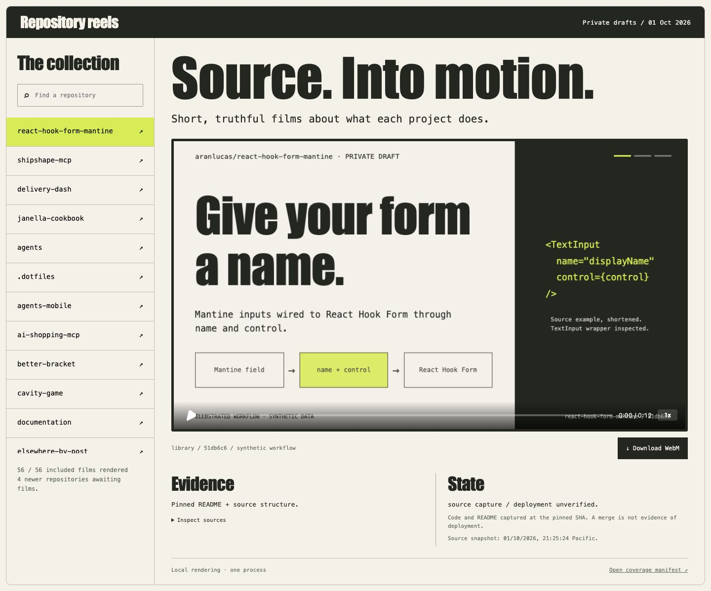

# Repository reels

Private screening room for 60 source-pinned repository films: the original 56 plus four separately dated follow-up films, rendered locally with the real HyperFrames engine and encoded with MediaBunny. Each film is a silent, three-scene, 12-second VP8 WebM at 960×540 and 12 fps. Search the collection, play a film, download it, and inspect its immutable source links.



## Technology stack

| Component | Version or requirement | Role |
| --- | --- | --- |
| React + React DOM | 19.3.0 | Screening-room interface, collection search and film selection. |
| Vite | 8.3.2 | Development server and production browser build. |
| HyperFrames engine + player | 0.8.107 | Deterministic HTML-to-frame rendering and embedded film playback. |
| MediaBunny | 1.61.0 | Local WebCodecs VP8 encoding, WebM muxing and media verification. |
| Node.js | 22.12 or newer | Local scripts and the built-in HTTP server, including video byte-range responses. |

The screening room runs locally at **http://127.0.0.1:4313**. It does not use Vercel hosting or the Vercel AI SDK, and it does not depend on TanStack Start or TanStack Router. Exact package versions are recorded in [package.json](package.json) and [package-lock.json](package-lock.json).

These stack details describe Repository Reels. The individual projects featured in the films have their own stacks; rendering a film does not change their frameworks or deployment setup.

## Open the collection

The original portable collection in Lucas's Library includes a built screening room and its 56 original films. Extract these three ZIPs into the same parent directory; all share one `repository-reels/` folder:

- `repository-reels--collection-app.zip`
- `repository-reels--collection-films-A.zip`
- `repository-reels--collection-films-B.zip`

To add the four later films and updated 60-film interface, extract `repository-reels--follow-up-four-films.zip` into that same parent directory and allow it to replace the screening-room files. The original 56 video bytes are preserved. The supplement alone requires the original three ZIPs.

Enter that folder and run `node scripts/serve.mjs` with Node 22.12 or newer. Open **http://127.0.0.1:4313**. No package installation is needed for that bundle. Stop with Ctrl-C. If another instance owns port 4313, use that instance or stop it before starting another. A single ZIP of the original 56-film bundle is also available in the local `artifacts/` directory. Three separate Library preview films showcase the forms library, Shipshape and Lanternwake.

From this private repository's implementation branch:

```sh
npm ci --ignore-scripts --no-fund
npm run build
npm run serve
```

The films, posters, source stills, generated compositions and verification evidence are committed deliberately so a fresh clone works. `dist/` and the portable ZIP are build artifacts. Repository history begins with an honest bootstrap; implementation is delivered through its reviewable PR.

## Exact coverage

The source snapshot began **October 1, 2026 at 9:25:24 pm Pacific** (`2026-10-02T04:25:24.864Z`); PR states were captured at `04:26:16.775Z`. It covers the original 47 owned repositories plus nine new prototypes. **56/56 included films rendered and fully decoded.**

A later inventory audit at **10:09:40 pm Pacific** (`2026-10-02T05:09:40.159911Z`) found 61 owned repositories:

- 56 included films.
- Four pending source review/films: `framebreak`, `pocket-park`, `trailbraid`, `orthogonal-router-rust-lab`, created after this source snapshot.
- One excluded: `repository-reels`, the collection itself, to avoid recursive coverage.

This is a dated capture, not a claim of complete coverage of every repository subsequently created. The exact list, SHA, evidence, pending/excluded names and video hash are in [manifest.json](manifest.json) and [inventory audit](evidence/inventory-audit.json).

## Separately dated follow-up

The four names pending in the historical audit are now covered by a separate follow-up captured through **October 1, 2026 at 11:16:41 PM Pacific** (`2026-10-02T06:16:41.983712+00:00`). Original source pins, proposal labels, capture date, compositions and all 56 original video hashes remain unchanged.

| Film | Pinned merged source | Interesting implementation | Boundary |
| --- | --- | --- | --- |
| Trailbraid | [`2ee73f9`](https://github.com/aranlucas/trailbraid/commit/2ee73f9b82b9ce779fcc60100c3d5b860756259a) | Turf 7.4.0 GPX geometry and shared elevation windows | Synthetic routes; no navigation or hazard assessment. |
| Framebreak | [`08e0589`](https://github.com/aranlucas/framebreak/commit/08e058989867b082c41702a11392f72177ac279a) | MediaBunny 1.61.0 local practice-video inspection and silent export | Browser codec support applies; original video stays local. |
| Pocket Park | [`3712526`](https://github.com/aranlucas/pocket-park/commit/371252687027e7dc2119f95ffe70725ffabadd56) | Planck 1.5.0 collisions and 120 Hz physics in five parks | Abstract puck game; local progress. |
| Orthogonal Router Rust Lab | [`29623e2`](https://github.com/aranlucas/orthogonal-router-rust-lab/commit/29623e2c155c19372f0e3152cce097c669cac5c1) | Typed Rust compatibility port and measured synthetic replay | Production routing unchanged; no WASM, Worker or deployed-performance claim. |

Each film pins the verified merge commit and links successful CI on that exact main SHA. The Rust result of 675 matched diagrams is a sampled compatibility check, not an all-input equivalence proof. Its [measured results and caveats](https://github.com/aranlucas/orthogonal-router-rust-lab/blob/29623e2c155c19372f0e3152cce097c669cac5c1/docs/results.md) distinguish native kernels from full roundtrips and host-specific memory observations.

[Follow-up source evidence](evidence/follow-up/source-review.json) and per-film capture times distinguish these four additions from the original snapshot. Three local QA screenshots supplied by the prototype work are included; their bytes were inspected and associated with clean checkouts matching the pinned commits. They are **not committed screenshots in the upstream source repositories**, and Repository Reels did not rerun those applications. [Screenshot provenance](evidence/follow-up/source-stills.json) records that distinction.

Current film coverage is **60/60 within the 61-repository historical inventory**, with the collection itself excluded and no remaining pending names from that audit. This reconciles the dated inventory; it does not assert a fresh account-wide inventory. The original Library collection stays a 56-film artifact; the four-film supplement updates it explicitly.

Five bootstrap-only prototypes use inspected implementation PR heads rather than describing an empty default branch: Elsewhere, Leavewell, Paper Options, Second Helping and Spoonworld. Their proposal state is historical. Later merges do not invalidate the pinned source but are not silently substituted into this capture. Four merged source changes were checked against their exact merge commits in [merge ancestry](evidence/merge-ancestry.json).

## What the films establish

Workflows are source-backed illustrations using synthetic data. Lanternwake, Elsewhere and Spoonworld additionally use inspected source screenshots pinned to their commits; their scenes explicitly say **SOURCE SCREENSHOT**. These films do not run, test or establish the deployment of the source applications. A merged source change and a live deployment are separate claims. Garmin remains labeled release blocked by its account/device migration.

Sensitive projects use purpose and metadata/structure only. Resumes, vault contents, corpus documents, medical details, financial values, holdings, credentials, private photos and location records are withheld. No external AI provider or new paid service is used. Nothing has been publicly released or deployed.

## Validation and browser evidence

```sh
npm run check
npm run verify
```

Eleven contract/privacy/coverage regression tests and the production build pass. `verify` checks every file's composition/video hashes, container readability, VP8 track, dimensions, duration, 144 packets, timing, seekable keyframes and three PNG scene captures. It also requires a complete full-decode report tied to those exact media hashes.

`npm run decode` separately decodes **all 8,640 frames across 60 films** through Chromium WebCodecs and MediaBunny, verifies frame order/dimensions/duration, and samples all three scenes for blank/black output. [Full decode evidence](evidence/verification-decode.json) and [media evidence](evidence/verification-media.json) are committed. Hosted CI verifies the hash-bound decode evidence; it does not download Chromium or rerun the browser decoder.

Actual in-app Chromium QA at 1440×960 and 390×844 covered search, selection, playback through 0:12, source disclosure, source-linked URLs and an actual downloaded film whose hash matched the manifest. Both viewports have no document-level horizontal overflow. Console error/warning capture was empty. A mobile poster-cropping defect in player 0.8.107 was found and fixed by sizing its shadow poster to the player bounds; library files are unmodified. [Desktop](evidence/browser/desktop.jpg), [mobile](evidence/browser/mobile.jpg), and [QA notes](docs/qa.md) are saved. Safari, Firefox and physical mobile devices were not tested. Desktop/landscape viewing makes the film's small source annotations easier to read.

Actual follow-up QA covered completed 0:12 playback for Framebreak, Trailbraid and the Rust lab at 1440×960, and Pocket Park at 390×844. Every selection showed its own follow-up capture time and exact source SHA; source links included the correct main CI run. The Framebreak download hash matched its manifest. Both widths had no document overflow, and warning/error logs were empty. [Follow-up desktop](evidence/browser/follow-up-desktop.jpg), [mobile](evidence/browser/follow-up-mobile.jpg), and [structured QA](evidence/follow-up/browser-qa.json) are saved.

## Refresh or render later

The browser renderer and full decoder use one existing Chromium process, no browser download, no browser pool, software GPU mode and a shared `.render.lock`. Set `REELS_CHROME` to a trusted installed Chromium executable on another machine; this Mac's existing Playwright headless shell is the default. Render work is sequential and bounded. Do not run render and decode together.

```sh
# Read-only GitHub capture using existing gh authorization. Never configure credentials here.
node scripts/refresh-evidence.mjs
# Inspect the new source evidence and add/review scripts/curation.mjs before composing.
npm run compose
# Review any source-still changes separately; protected projects cannot include screenshots.
npm run render
npm run decode
npm run verify
npm run check
```

The original capture and follow-up evidence are intentionally separate. Before an account-wide refresh, archive or replace the follow-up deliberately; `compose` rejects a repository duplicated across captures rather than silently redating it.

`compose` refuses an uncurated repository and preserves a passed render only when the composition hash is unchanged. An explicit `npm run render -- name --force` rerenders one film. Capture and verification evidence must be refreshed together; old decode evidence cannot validate changed media. The refresh script updates a fixed set of relevant PRs plus bootstrap implementation PR heads; human review is still required for a newly relevant PR. Update the inventory audit for a new source snapshot.

## Libraries and research

[Research and ranked shortlist](docs/research.md) records fresh primary daily/weekly GitHub Trending captures, maintenance/release evidence, license observations, stale cached examples and the selection rationale. HyperFrames **0.8.107** and MediaBunny **1.61.0** are pinned. Registry installs disable lifecycle scripts. Browser assets include [third-party notices](public/THIRD_PARTY_NOTICES.md) and the actual upstream license texts under `public/licenses/`.
